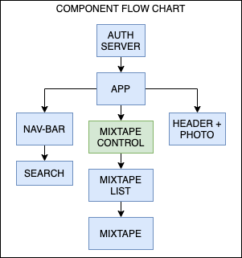
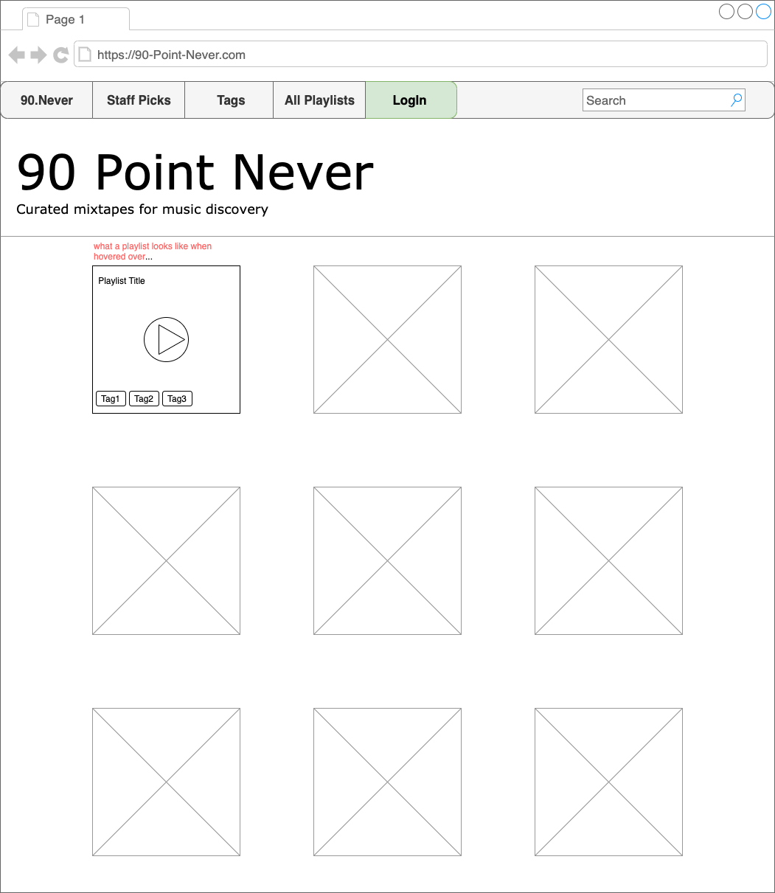

# 90 POINT NEVER 
## A WEB APPLICATION FOR SPOTIFY PLAYLIST DISCOVERY 

## Description: 
_This application was developed during the capstone week at Epicodus. My reason for choosing this project was to become more familiar with using React, Redux, and Api's, and Firebase. The goal of this application was to create a platform for a curated list of Spotify playlists that can be played in the browser by the use of Spotify OAuth. Further stretch goals of this project include searchability, adding tags, adding a button that allows the user to follow a playlist, and deployment._

#### By Drake Wilcox

## UI: 

## Component Flow Chart:

## WireFrame Mock-up: 

## User Stories
* A User should be able to sign into the page via Spotify Authorization. 
* A User should be able to view a grid of playlists cover images displayed on a grid
* A User should be able to navigate to a playlist details when clicking on a playlist on the home page. 
* A User should be play the playlist in the browser window without leaving the page. 

## Installation/Setup

#### Node install

###### For macOS:
_If Homebrew is not installed on your computer already, then install Homebrew by entering the following two commands in Terminal:_
* ``/usr/bin/ruby -e "$(curl -fsSL https://raw.githubusercontent.com/Homebrew/install/master/install)``
* ``echo 'export PATH=/usr/local/bin:$PATH' >> ~/.bash_profile``

_Install Git by entering the following command in Terminal:_
* ``brew install git``

_Next, install Node.js by entering the following command in Terminal:_
* ``brew install node``

###### For Windows:
_Please visit the [Node.js website](https://nodejs.org/en/download/) for installation instructions._

#### Install Client and Auth-Server Applications: 
##### To start Auth-Server: 
* ``cd desktop``
* ``git clone https://github.com/drakewilcox/nine-point-never``
* ``cd cd nine-point-never/auth-server``
* ``npm install``
* ``node authorization_code/app.js``
* ``dotnet watch run``
##### To start client application from root directory: 
* ``cd client``
* ``npm intall``
* ``npm start``

_Open the contents of this application in a text editor or IDE of your choice (e.g., to open the contents of the directory in Visual Studio Code on macOS, enter the command ``code .`` in Terminal)._

## Technologies Used

* Git
* JavaScript
* Firebase
* npm
* Webpack
* React
* Redux
* React-Redux
* Fetch library
* React Bootstrap component library

## Support and Contact Details
_Have a bug or an issue with this application? [Open a new issue](https://github.com/drakewilcox/nine-point-never/issues) here on GitHub._

## License
[MIT](https://choosealicense.com/licenses/mit/)

Copyright (c) 2020 **_Drake Wilcox_**

